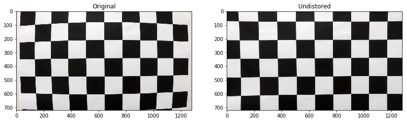
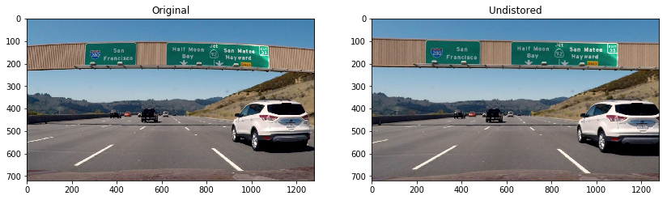
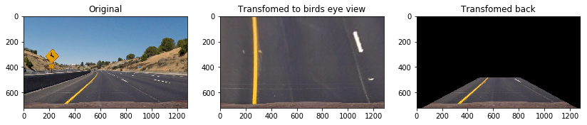
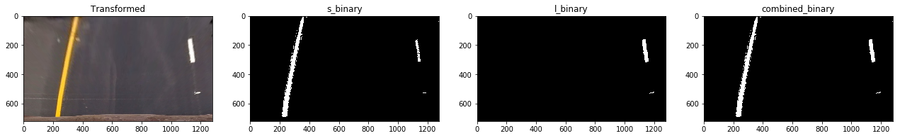
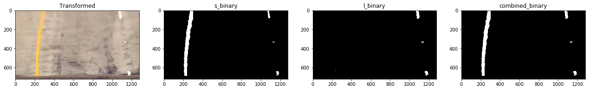
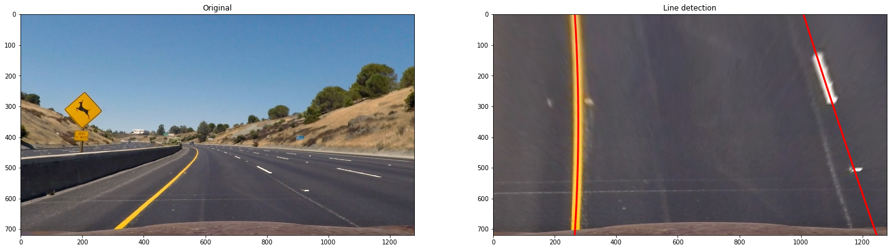
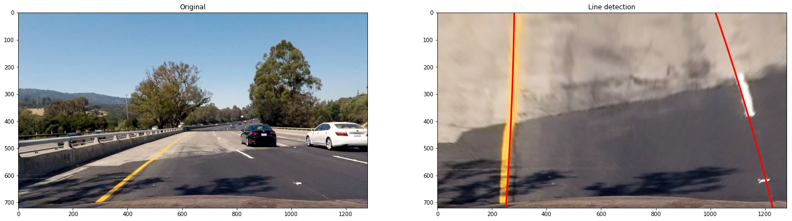
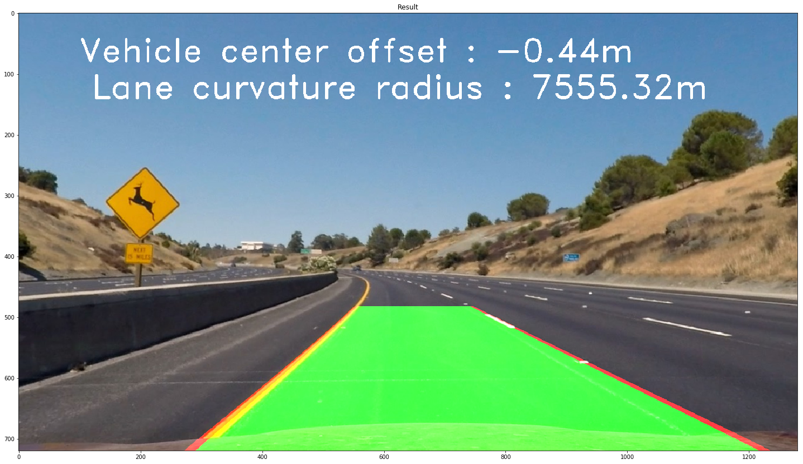

#Advanced Lane Finding Project

**All steps described in the sections below and it's results can also be seen in
[jupiter notebook](./advanced_lane_finding.ipynb) of this project.**
---

## Camera Calibration

The code for the camera calibraion is in the file called [calibration.py line 8-34](./calibration.py#L8-L34).

I start by preparing "object points", which will be the (x, y, z) coordinates of the chessboard corners in the world.
Here I am assuming the chessboard is fixed on the (x, y) plane at z=0, such that the object points are the same
for each calibration image. 
`imgpoints` will be appended with the (x, y) pixel position of each of the corners in the image plane with each
successful chessboard detection.  

I then used the output `objpoints` and `imgpoints` to compute the camera calibration and distortion coefficients 
using the `cv2.calibrateCamera()` function. 

I applied this distortion correction to the test image using the `cv2.undistort()` function and obtained this result: 

---
## Pipeline (single images)

The whole code for the image processing pipeline is in [pipeline.py](./pipeline.py).

The pipeline contains of the following major steps:

* Image distortion correction ([line 28](./pipeline.py#L28))
* Transform image to bird eyes view ([line 31](./pipeline.py#L31))
* Applying combined binary threshold ([line 34-39](./pipeline.py#L34-L39))
* Search lane lines and fit a polynomial to each line ([line 41-46](./pipeline.py#L41-L46))
* Calculate the vehicle offset to the lane center ([line 63-66](./pipeline.py#L63-L66))
* Calculate the lane curvature radius ([line 68-77](./pipeline.py#L68-L77))
* Annotate the image with the polynomials ([line 79-86](./pipeline.py#L79-L86))
* Transform image back from bird eyes view to the original perspective ([line 88](./pipeline.py#L88))
* Plot the calculated vehicle offset and lane curvature radius on the result image ([line 92-98](./pipeline.py#L92-L98))

Note: In contrast to the processing pipeline introduced by this module I swaped the thresholding and trasformation step,
because I found it easier to experiment with the thresholds on the wraped image.

### Distortion Correction
I used the code described in the section above to do the distortion correction.

The follwing image shows the result of the distortion correction applied a test image:

### Perspective Transform
The code for my perspective transform is located in file [perspective.py](perspective.py).
The class `Transformer` calculates the transformation matrix `M` and it's inverse `Minv`.

 I used the following source and destination points:

| Source        | Destination   | 
|:-------------:|:-------------:| 
| 490, 482      | 0, 0         | 
| 810, 482      | 1280, 0      |
| 1250, 720     | 1280, 720    |
| 40, 720       | 0 720        |

The matrices are then used to by the functions `to_top_view` and `from_top_view` to transform
images to bird eye view and and back.

Here's an example of the perspective transformation applied to one test image:

### Binary Thresholding

I used a combination of s-channel threshold in HLS space and l-channel threshold LUV space.
The code for calculating each channel thresholds is in [threshold.py line 60-68](threshold.py#L60-L68).

The combining step is in [pipeline.py line 34-39](./pipeline.py#L34-L39).

Here're some examples of my output for this step:

### Lane Pixel Finding and Polynomial Fitting
The code for finding the lane line pixels and polynomial fitting is in [find_lanes.py](find_lanes.py).

Lane lines are fitted to new image frames by the function [`initial_fit`](find_lanes.py#L3).
It uses a [histogram](find_lanes.py#L90-96) to find the starting points for the left and right line and
the applies the[`sliding_window_search`](find_lanes.py#L101) function, which works exactly like the function introduced 
in this classroom module.

The found lane pixels are the passed to a [curve fitting function ](find_lanes.py#L51) that fits 2d polynomial to
the given points.

Here're some examples of output for the lane fitting  step:

### Vehicle Offset and Lane Curvature Radius
The code for calculating the  lateral vehicle offset to the lane center and lane curvature radius can be found
in [pipeline.py line 63-77](pipeline.py#L63-L77).

First the conversion parameters in x and y from pixels space to meters are defined (line 60-61).
The pixel offset to the lane center is then calculated and translated into meter (line 65-66).

For calculating the curvature radius new polynomials are fitted in world space (line 70-71).
These polynomials are the used to determine the curvature radius of the left and right lane 
at the y position (image bottom) of the vehicle (line 75-76). The average of the values
is defined as the lane curvature radius (line 77).

### Final Image Plot
Finally the polynomial lines are plotted on the wraped image [line 79-86](./pipeline.py#L79-L86).
The image is the transformed back into the original perspective [line 88](./pipeline.py#L88).
Vehicle offset and curvature radius is plotted on the resulting image [line 92-98](./pipeline.py#L92-L98).

Here's an example of the final result:

### Pipeline (video)

For detecting lane lines in a video I used the image processing pipeline described in the previous section.
To improve the performance I introduced two additional features.

If a valid fitting exists for the previously processes image frame see ,([line 179-180](./pipeline.py#L79-L86))
the line fitting of the new frame is not done by a sliding window search. Instead the left and right lane pixels are
searched in the near area of the existing polynomial fit. The code for this step is [here](./pipeline.py#L136).

To make the lane detection more robust against outliers I decided to to average the polynomial
parameters of the fitted lane curves over the last 12 image frames.
The code for averaging is in [line 57-69](./pipeline.py#L57-L69) and [line 78-79](./pipeline.py#L78-L79).

This gave me a much "smoother" result.

The final video can be found [here](./output_videos/project_video_ouput.mp4).

---

### Discussion

As shown by the video the pipeline really works well for most of the time, especially under ideal condition.
During the end it can be seen that the lane detection has some issues with dark shadows on the road and 
the detection lines are slightly wobbling.

To make the lane detection more robust in very shadow conditions, I guess the binary thresholding needs to improved.
I would need to investigate if any other combination of channels selection and/or fine tuning the threshold values
will lead to better results.

Another idea could be to vary the thresholding parameters depending on the properties of captured image.
To implement this approach each image would need to be further analyzed before the thresholding is applied.
Relevant properties could be the overall image brightness, contrast, etc.

